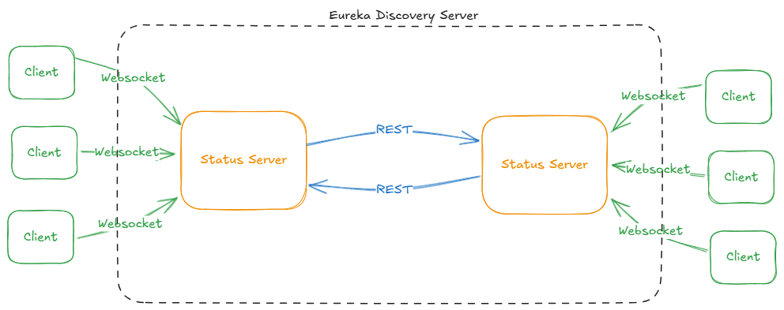
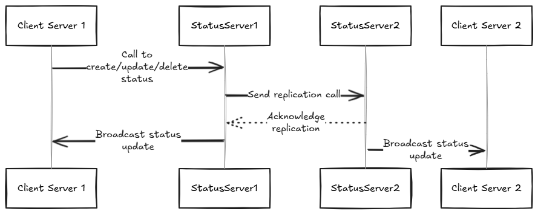

# Status Server - Spring Boot & WebSockets

A distributed system for real-time monitoring of service statuses using Spring Boot microservices, Eureka for service discovery, WebSocket (STOMP) messaging, and a frontend client.

## Architecture

- **Eureka Server** (`eureka-server`) - Service discovery for load balancing
- **Status Service** (`status-service`) – Handles WebSocket messaging and broadcasting via STOMP
- **Frontend** – Next.js client connecting directly to status service via WebSocket



## Tech Stack

- Spring Boot
- Spring WebSocket (STOMP)
- Eureka Discovery Service
- Docker & Docker Compose
- Next.js with TypeScript (Frontend)
- STOMP.js for WebSocket communication

## Key Endpoints

| Route                   | Service          | Purpose                             |
|-------------------------|------------------|-------------------------------------|
| `/app/status`           | `status-service` | Endpoint to publish status updates  |
| `/app/request-statuses` | `status-service` | Request existing status messages    |
| `/topic/status`         | `status-service` | Topic for status update broadcasts  |
| `/topic/init-status`    | `status-service` | Topic for initial status messages   |
| `/topic/status-delete`  | `status-service` | Topic for status deletion events    |
| `/status-websocket-*`   | `status-service` | WebSocket STOMP connection endpoint |

## WebSocket Setup

### Backend (`status-service`)

```java
registry.addEndpoint("/status-websocket-{port}")
        .setAllowedOriginPatterns("*")
        .setAllowedOrigins("*");
```

## Client (`frontend`)
The frontend implements a real-time status dashboard that allows users to:

Connect to different server instances (ports 9001, 9002)
Send status updates:
Predefined statuses (UP, DOWN)
Custom status messages
View real-time status updates from all connected users

```typescript
// WebSocket connection setup
const gatewayWsUrl = `ws://localhost:${selectedServer.port}/status-websocket-${selectedServer.port}`;

stompClientRef.current = new window.StompJs.Client({
    brokerURL: gatewayWsUrl,
    reconnectDelay: 5000,
    // Configuration and handlers...
});

// Subscriptions
stompClientRef.current.subscribe("/topic/status", (message) => {
    const status = JSON.parse(message.body);
    updateStatus(status);
});

stompClientRef.current.subscribe("/topic/init-status", (message) => {
    const status = JSON.parse(message.body);
    updateStatus(status);
});

stompClientRef.current.subscribe("/topic/status-delete", (message) => {
    const id = Number(message.body);
    setStatuses((prev) => prev.filter((s) => s.id !== id));
});

// Send status message
stompClientRef.current.publish({
    destination: "/app/status",
    body: JSON.stringify({
        username: connectedUsername,
        statusText: statusText,
    }),
});
```

## Message Structure
```typescript
interface StatusMessage {
    id: number;        // Unique identifier for the status
    username: string;  // Username of the status sender
    statustext: string; // Content of the status message
    timestamp: string; // Server timestamp when message was received
}
```

## Building & Running the Project
1. Build Java services:
    ```bash
    # Build Eureka Server
    cd eureka-server
    .\mvn clean package

    # Build Status Service
    cd ../status-service
    .\mvn clean package
    ```
2. Build React project:
    ```bash
    # Build Eureka Server
    cd ../frontend
    npm install
    npm run build
    ```

3. Run application with Docker:
    ```
    docker compose up --build
    ```

## Status Replication System
The status-service implements a peer-to-peer replication mechanism to ensure all instances maintain a consistent state across the distributed system.

### Replication Configuration
Status service instances are configured with peer information through properties:
```YAML
status:
  peers:
    - http://localhost:9001
    - http://localhost:9002
```
### How Replication Works
When a status is created or updated, the service broadcasts the message to all peers. Each peer then processes the message and updates its local state accordingly.

**Replication Process Flow**:
- Event Triggering: When a status update occurs (creation or modification), the originating service instance detects this change
- Broadcasting: The service broadcasts the updated status message to all peers listed in its configuration
- Message Reception: Each peer receives the update message, likely via a REST endpoint
- Local State Update: Upon receiving the message, peers process it and update their local state


